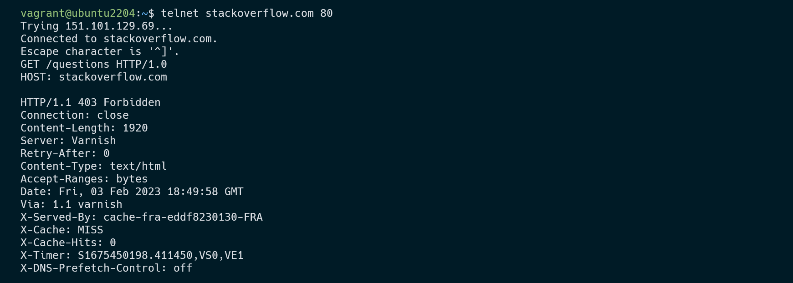
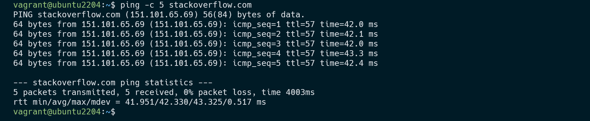
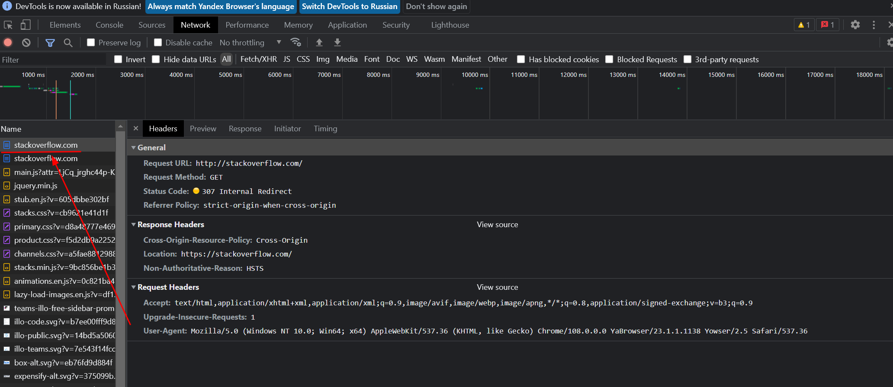
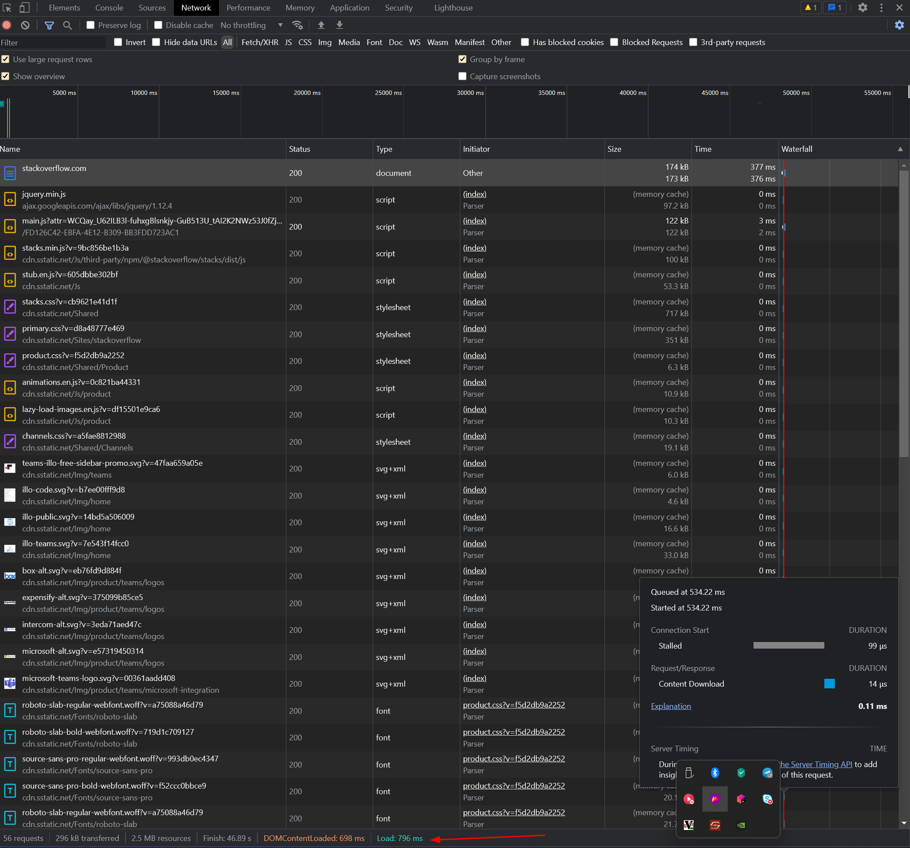
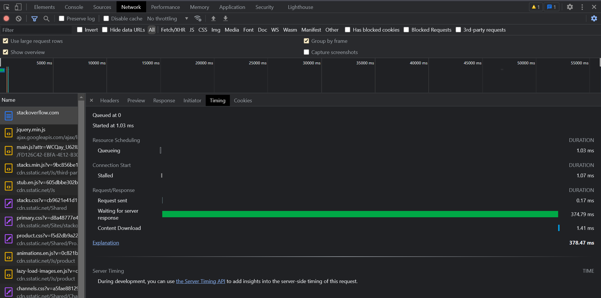
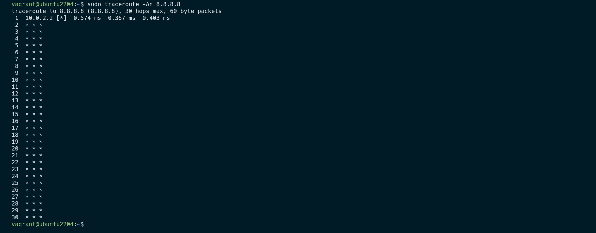
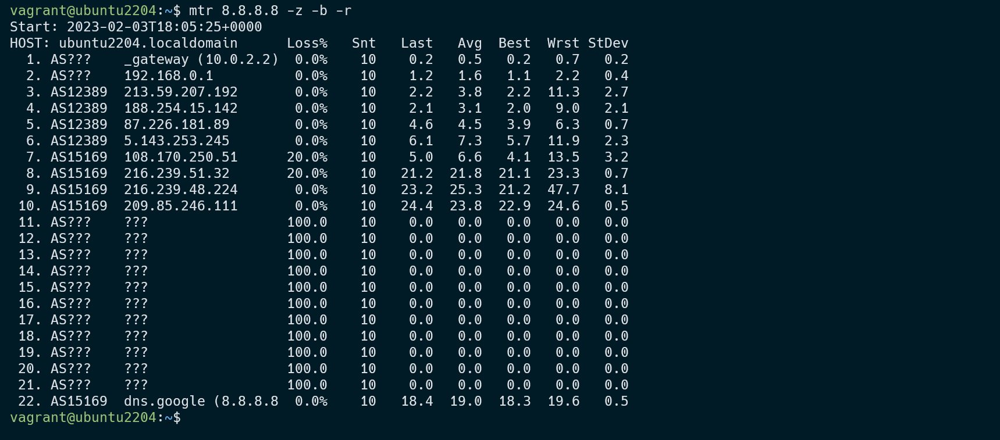
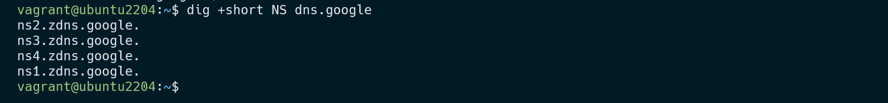
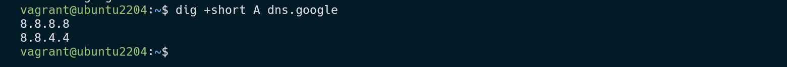

####################################
### Васильев Евгений,  devops-26
####################################


# Домашнее задание к занятию "Компьютерные сети. Лекция 1"


------

## Задание

1. Работа c HTTP через телнет.
- Подключитесь утилитой телнет к сайту stackoverflow.com
  `telnet stackoverflow.com 80`
- Отправьте HTTP запрос
```bash
GET /questions HTTP/1.0
HOST: stackoverflow.com
[press enter]
[press enter]
```
*В ответе укажите полученный HTTP код, что он означает?*

1 Решение:

в ответе получили Ошибку сервера 403, странно что несработал редирект 301 на https,  403 Forbidden означает ограничение или отсутствие доступа к материалу на странице, которую вы пытаетесь загрузить




могу предположить, что не этот ответ ожидали, но япопробовал ping и ответ был следующий:



также воспользовался утилитой curl, если вводить адрес curl https://151.101.65.69 то он ведет нас на страницу сайта, а если изменить протокол с https на http то curl утилита ни чего не выдает

---

2. Повторите задание 1 в браузере, используя консоль разработчика F12.
- откройте вкладку `Network`
- отправьте запрос http://stackoverflow.com
- найдите первый ответ HTTP сервера, откройте вкладку `Headers`
- укажите в ответе полученный HTTP код
- проверьте время загрузки страницы, какой запрос обрабатывался дольше всего?
- приложите скриншот консоли браузера в ответ.

2 Решение:

Полученный код 307 – Temporary Redirect (Временный редирект). могу предположить что редирект с http на https




время загрузки 796 ms



дольше всего обрабатывалась начальная загрузка страницы 3,68 мс



---

3. Какой IP адрес у вас в интернете?

3 Решение


---

4. Какому провайдеру принадлежит ваш IP адрес? Какой автономной системе AS? Воспользуйтесь утилитой `whois`

4 Решение:

 Адрес принадлежит: Istra PPPoE pool; CTC-JNPR-1


Автономная системы: AS25515


---

5. Через какие сети проходит пакет, отправленный с вашего компьютера на адрес 8.8.8.8? Через какие AS? Воспользуйтесь утилитой `traceroute`

5 Думаю это не верный ответ, но другого мне не выдало хотя в нагромождении возможных вариантов увяз



---
6. Повторите задание 5 в утилите `mtr`. На каком участке наибольшая задержка - delay?

6 Решение

наибольшая задержка: ``` 10. AS15169  209.85.246.111       0.0%    10   24.4  23.8  22.9  24.6   0.5 ```



---

7. Какие DNS сервера отвечают за доменное имя dns.google? Какие A записи? Воспользуйтесь утилитой `dig`

7 Решение: 





---

8. Проверьте PTR записи для IP адресов из задания 7. Какое доменное имя привязано к IP? Воспользуйтесь утилитой `dig`

8 Решение

dns.google


-----

