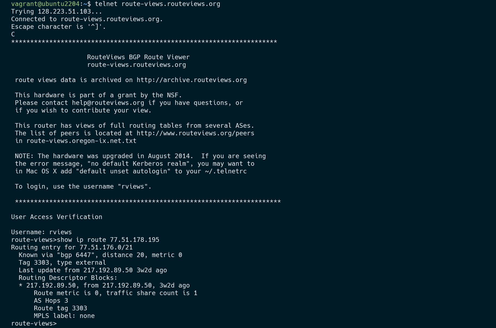
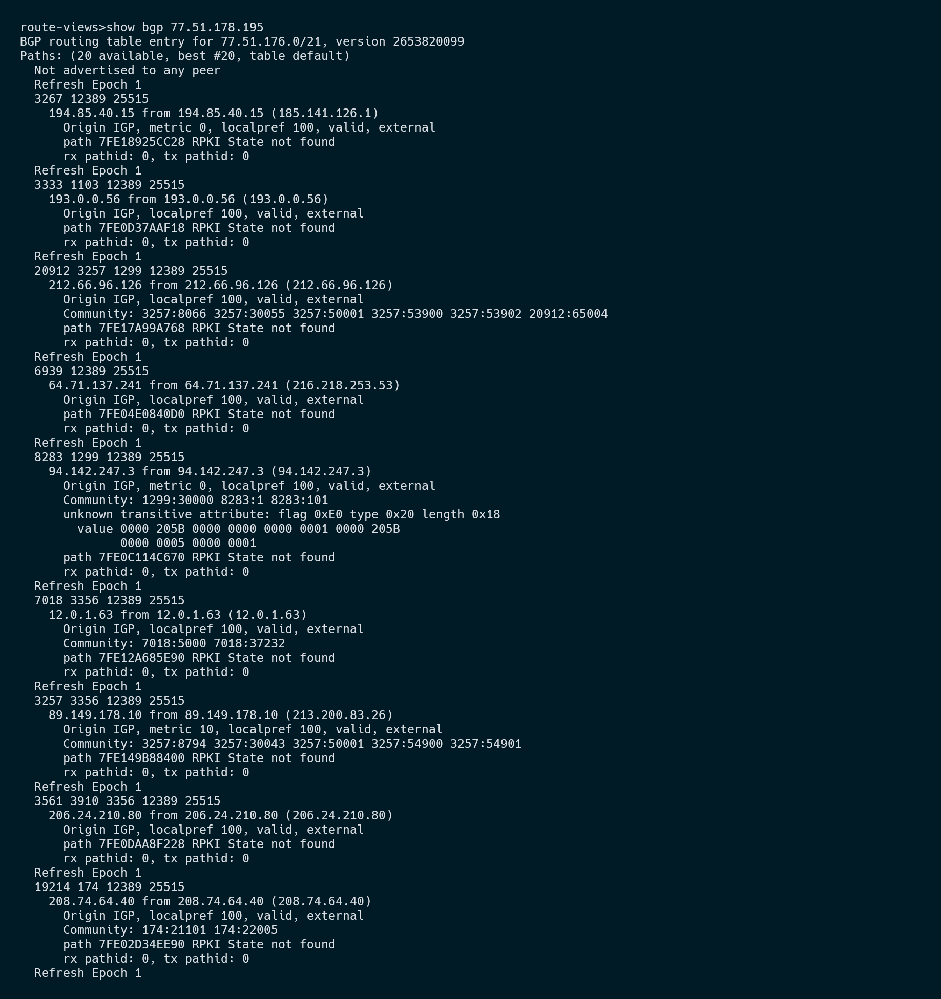
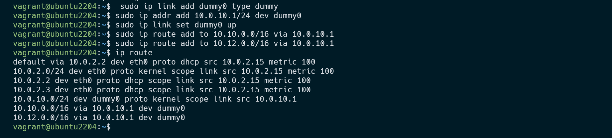
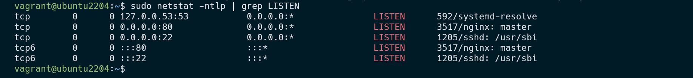
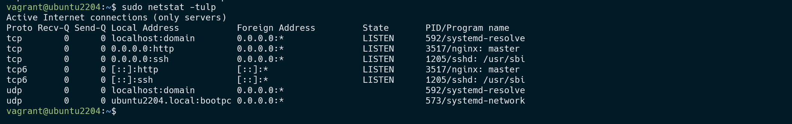
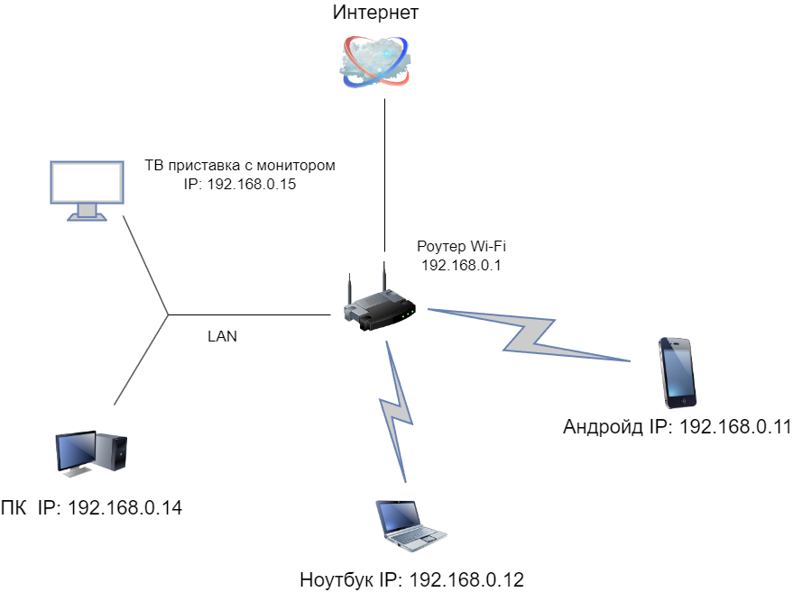

####################################
### Васильев Евгений,  devops-26
####################################


# Домашнее задание к занятию "Компьютерные сети.Лекция 3"


------

## Задание

1. Подключитесь к публичному маршрутизатору в интернет. Найдите маршрут к вашему публичному IP
```
telnet route-views.routeviews.org
Username: rviews
show ip route x.x.x.x/32
show bgp x.x.x.x/32
```
1 Решение:




---

2. Создайте dummy0 интерфейс в Ubuntu. Добавьте несколько статических маршрутов. Проверьте таблицу маршрутизации.

2 Решение:




---

3. Проверьте открытые TCP порты в Ubuntu, какие протоколы и приложения используют эти порты? Приведите несколько примеров.

3 Решение:

nginx работает, в данный момент, на 80 порту - `tcp        0    0 0.0.0.0:80`, 
ssh работает на 22 порту - `tcp        0      0 0.0.0.0:22              0.0.0.0:*               LISTEN      1205/sshd: /usr/sbi`



---

4. Проверьте используемые UDP сокеты в Ubuntu, какие протоколы и приложения используют эти порты?

4 Решение:

Протоколы UDP:

```
udp        0      0 localhost:domain        0.0.0.0:*                           592/systemd-resolve
udp        0      0 ubuntu2204.local:bootpc 0.0.0.0:*                           573/systemd-network
```



---


5. Используя diagrams.net, создайте L3 диаграмму вашей домашней сети или любой другой сети, с которой вы работали.

5 Решение:



-----

