####################################
### Васильев Евгений,  devops-26
####################################


# Домашнее задание к занятию "Файловые системы"


------

## Задание

1.Узнайте о sparse (разряженных) файлах.

---

1. Решение:

пример (при помощи dd) создания не разряженного файла:

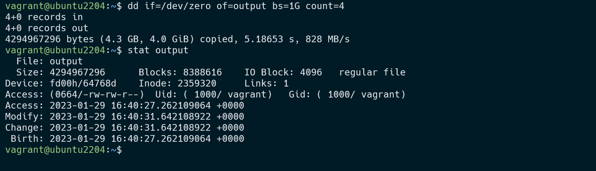

пример создания (при помощи dd) разряженного файла:

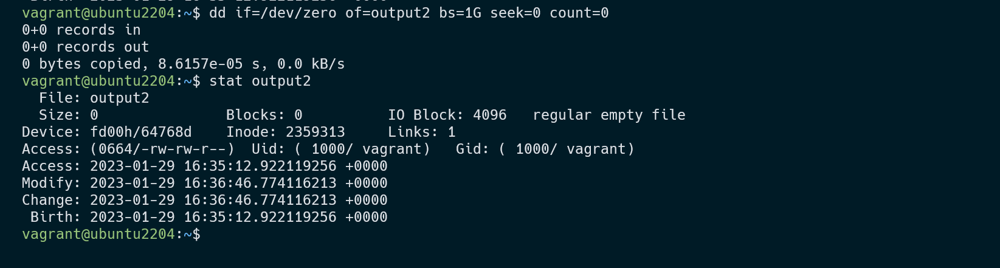

Информация из Википедии:

Разрежённый файл (англ. sparse file) — файл, в котором последовательности нулевых байтов[1] заменены на информацию об этих последовательностях (список дыр).

Дыра (англ. hole) — последовательность нулевых байт внутри файла, не записанная на диск. Информация о дырах (смещение от начала файла в байтах и количество байт) хранится в метаданных ФС.

Преимущества и недостатки
Преимущества:

экономия дискового пространства. Использование разрежённых файлов считается одним из способов сжатия данных на уровне файловой системы;
отсутствие временных затрат на запись нулевых байт;
увеличение срока службы запоминающих устройств.
Недостатки:

накладные расходы на работу со списком дыр;
фрагментация файла при частой записи данных в дыры;
невозможность записи данных в дыры при отсутствии свободного места на диске;
невозможность использования других индикаторов дыр, кроме нулевых байт.

---
2. Могут ли файлы, являющиеся жесткой ссылкой на один объект, иметь разные права доступа и владельца? Почему?


2. Решение:

Не могут, на моём скрине показаны ряд действий который подтверждает это. 
Был создан юзер test01 (sudo adduser test01), для одной жесткой ссылки был изменен владелец и группа командой chown с vagrant на test01, и были изменены права доступа на chmod 777 в итеге 
такие же права и доступы оказалить и у второй жесткой ссылки и файла на которы ссылались жесткие ссылки, также и права доступа на chmod 777, оказались и у обоих жестких ссылок и изначалоно созданного файла.

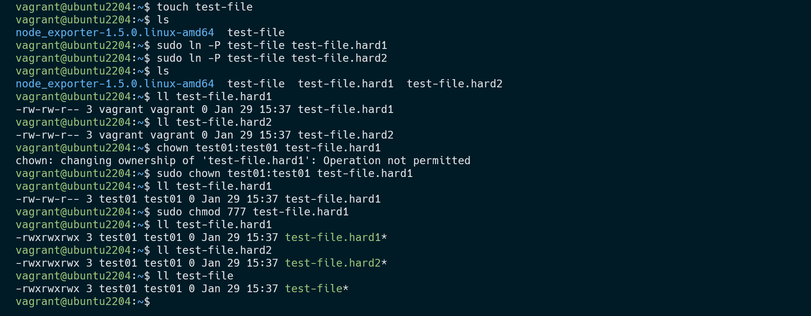

Вывод: созданные мною ссылки, это ссылки на один и тот же inode, в нём и хранятся права доступа и имя владельца.

---

3. Сделайте vagrant destroy на имеющийся инстанс Ubuntu. Замените содержимое Vagrantfile следующим:

```
path_to_disk_folder = './disks'
host_params = {
'disk_size' => 2560,
'disks'=>[1, 2],
'cpus'=>2,
'memory'=>2048,
'hostname'=>'sysadm-fs',
'vm_name'=>'sysadm-fs'
}
Vagrant.configure("2") do |config|
config.vm.box = "bento/ubuntu-20.04"
config.vm.hostname=host_params['hostname']
config.vm.provider :virtualbox do |v|

        v.name=host_params['vm_name']
        v.cpus=host_params['cpus']
        v.memory=host_params['memory']

        host_params['disks'].each do |disk|
            file_to_disk=path_to_disk_folder+'/disk'+disk.to_s+'.vdi'
            unless File.exist?(file_to_disk)
                v.customize ['createmedium', '--filename', file_to_disk, '--size', host_params['disk_size']]
            end
            v.customize ['storageattach', :id, '--storagectl', 'SATA Controller', '--port', disk.to_s, '--device', 0, '--type', 'hdd', '--medium', file_to_disk]
        end
    end
    config.vm.network "private_network", type: "dhcp"
end
```
3. Решение:

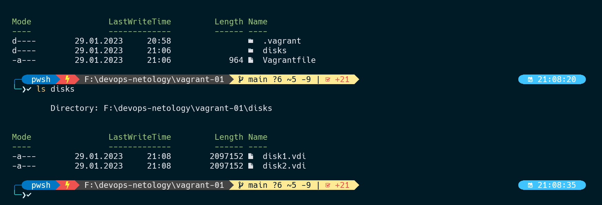

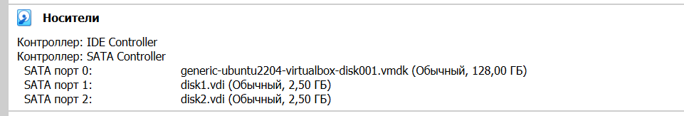

---

4. Используя fdisk, разбейте первый диск на 2 раздела: 2 Гб, оставшееся пространство.

4 Решение:

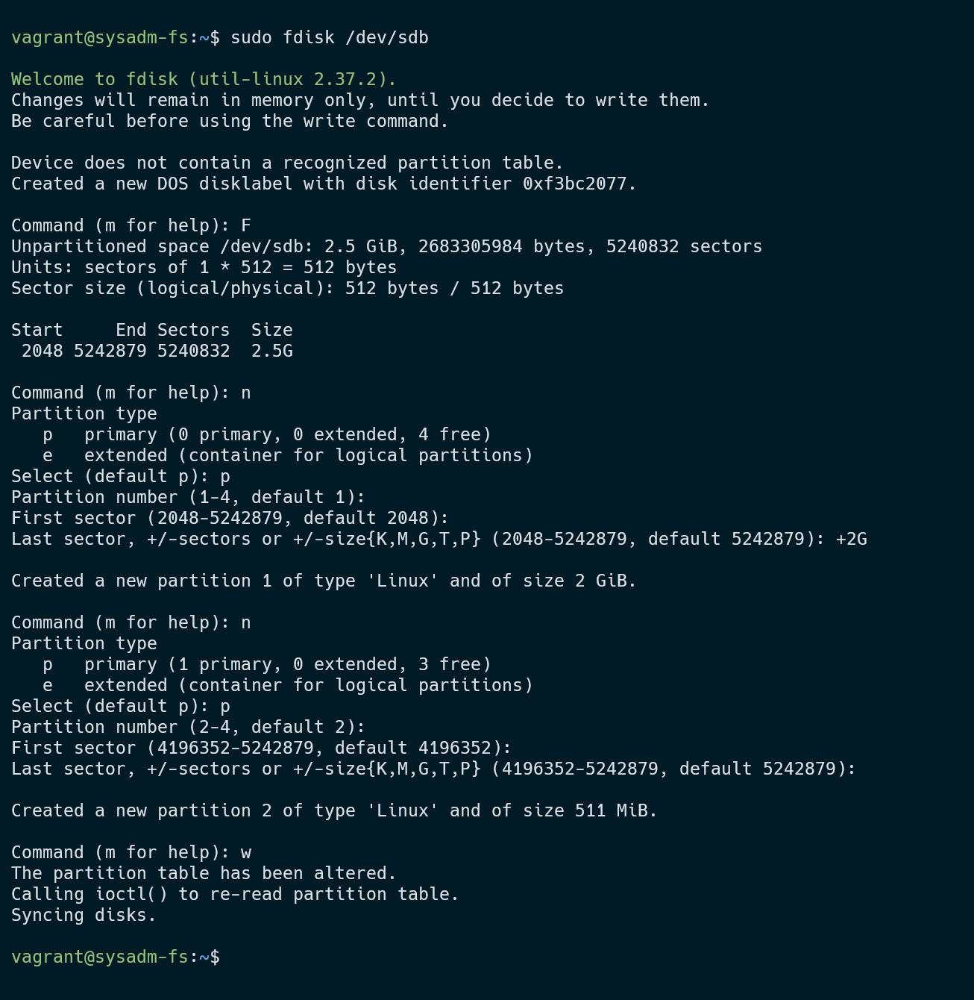

---

5. Используя sfdisk, перенесите данную таблицу разделов на второй диск.

5 Решение:

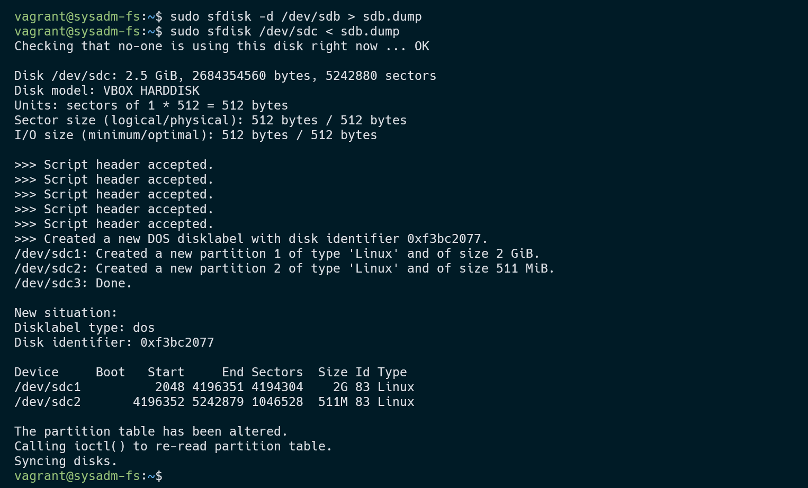

---

6. Соберите mdadm RAID1 на паре разделов 2 Гб.

6 Решение:


---

7.Соберите mdadm RAID0 на второй паре маленьких разделов.

7. Решение:

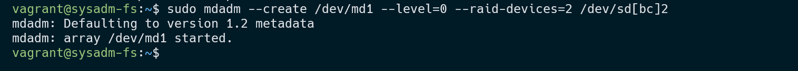

---

8. Создайте 2 независимых PV на получившихся md-устройствах.

8 Решение:

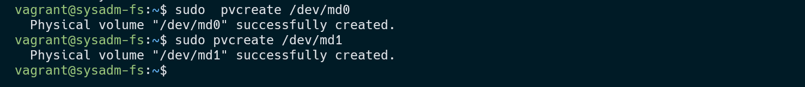

---

9. Создайте общую volume-group на этих двух PV.

9 Решение:

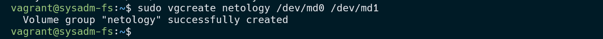

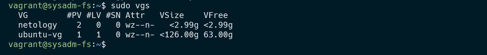

---

10.  Создайте LV размером 100 Мб, указав его расположение на PV с RAID0.

10 Решение:

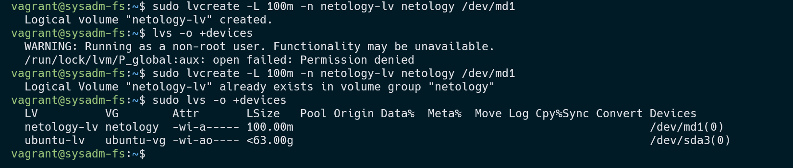

---

11. Создайте mkfs.ext4 ФС на получившемся LV.

11 Решение:

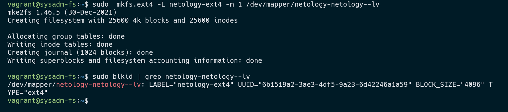

---

12. Смонтируйте этот раздел в любую директорию, например, /tmp/new.

12 Решение:

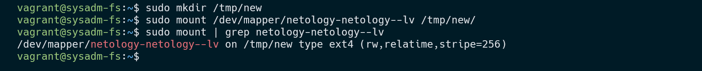

---

13.  Поместите туда тестовый файл, например wget https://mirror.yandex.ru/ubuntu/ls-lR.gz -O /tmp/new/test.gz.

13 Решение:

cd /tmp/new
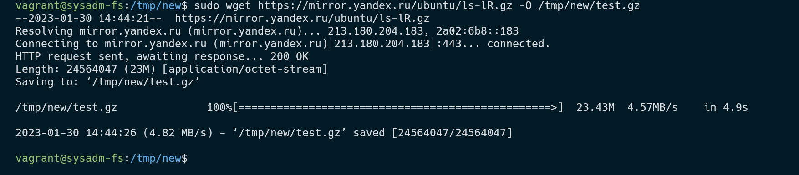

---

14. Прикрепите вывод lsblk.

14 Решение:

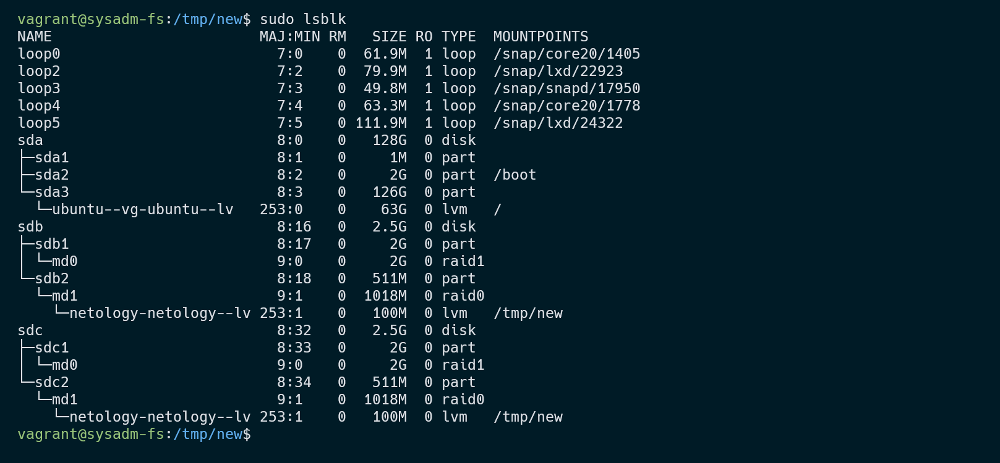

---

15. Протестируйте целостность файла:

15 Решение:

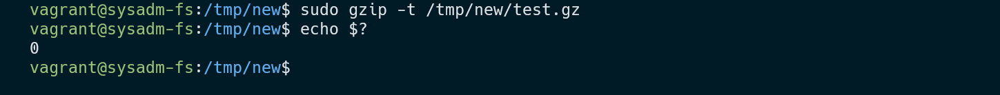

---

16. Используя pvmove, переместите содержимое PV с RAID0 на RAID1.

16 Решение: 

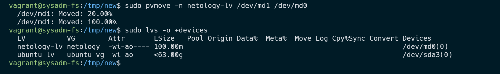

---

17. Сделайте --fail на устройство в вашем RAID1 md.

17 Решение:

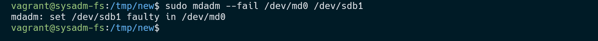

---

18. Подтвердите выводом dmesg, что RAID1 работает в деградированном состоянии.

18 Решение:

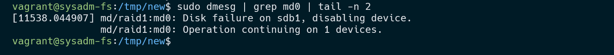

---

19. Протестируйте целостность файла, несмотря на "сбойный" диск он должен продолжать быть доступен:

19 Решение:


---

20. Погасите тестовый хост, vagrant destroy.

20 Решение:

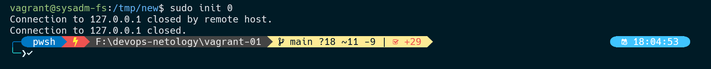


-----

