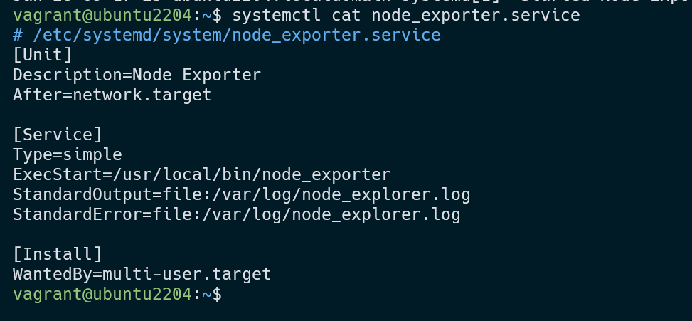
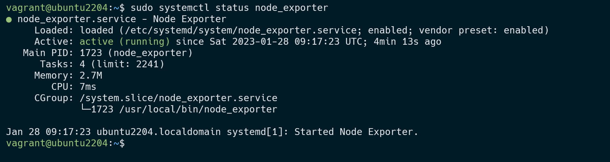
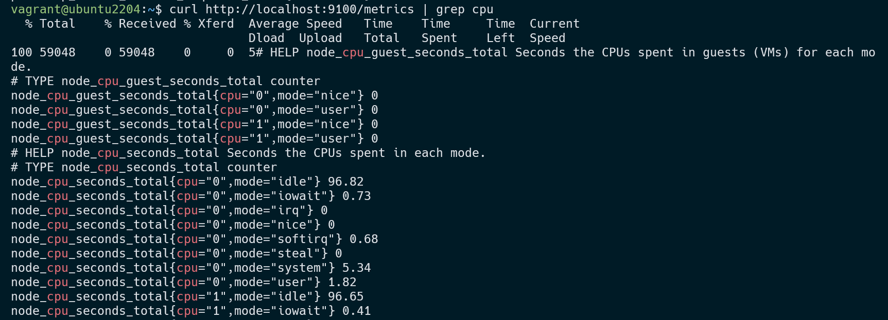
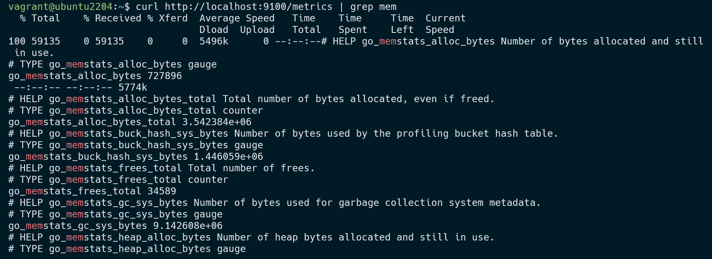
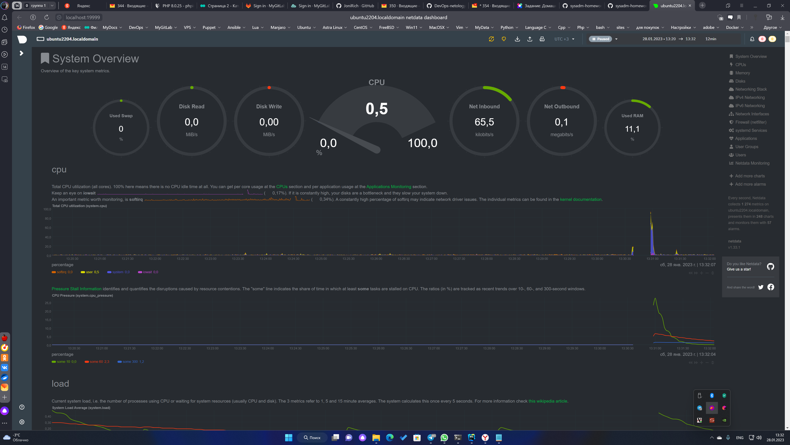
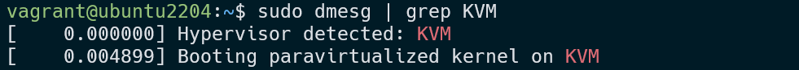
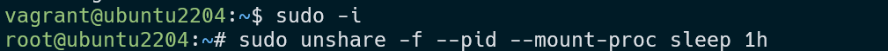
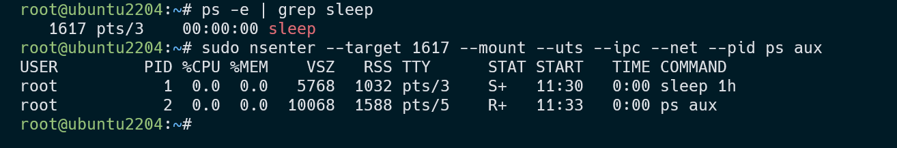
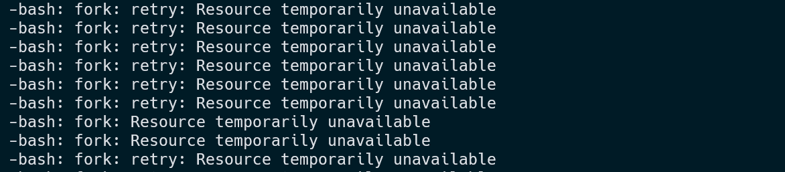

####################################
### Васильев Евгений,  devops-26
####################################


# Домашнее задание к занятию "Операционные системы. Лекция 2"


------

## Задание

1. 
  ```cd /tmp
wget https://github.com/prometheus/node_exporter/releases/download/v1.5.0/node_exporter-1.5.0.linux-amd64.tar.gz
tar xzf node_exporter-1.5.0.linux-amd64.tar.gz
sudo touch /opt/node_exporter.env
echo "EXTRA_OPTS=\"--log.level=info\"" | sudo tee /opt/node_exporter.env
sudo mv node_exporter-1.5.0.linux-amd64/node_exporter /usr/local/bin/
```


```angular2html
sudo systemctl daemon-reload
sudo systemctl start node_exporter
sudo systemctl enable node_exporter
sudo systemctl status node_exporter

```



2.

curl http://localhost:9100/metrics

curl http://localhost:9100/metrics | grep cpu


curl http://localhost:9100/metrics | grep mem




3. 



4.  

Можно, например dmesg | grep KVM сообщение Hypervisor detected пример на скрине



5.

fs.nr_open - жесткий лимит на открытые дескрипторов для ядра системы

```angular2html
a.) fs.nr_open = 1048576
```
Soft limit на пользователя, может быть изменен как большую, так и меньшую сторону

```angular2html
b.) ulimit -Sn
    1024
```

Hard limit на пользователя, может быть изменен только в меньшую сторону.

```angular2html
c.) ulimit -Hn
    1048576
```

Оба ulimit -n не могут превышать fs.nr_open

6.
терминал 1



терминал 2




7. 
После ввода команды :(){ :|:& };: систему (Ubuntu 22.04) сотрясало, от этой  цикличности и конца этому не было

:() означает, что вы определяете функцию под названием :

{:|: &} означает запустить функцию :и :снова отправить ее вывод в функцию и запустить ее в фоновом режиме.

Это ; разделитель команд.

: запускает функцию в первый раз.



загуглил и нашел такую информацию - На самом деле, называется эта команда "бомба-вилка", потому что она делает именно функцию bash, которая вызывает себя дважды и так далее. Вы можете заменить : с именем, если вы хотите, чтобы это стало более очевидным:
```angular2html
fu{
fu | fu &
}; fu
```

Так fuвызывает себя, передавая свой вывод через себя снова, и таким образом заполняет ваш процессор запросами.

-----

